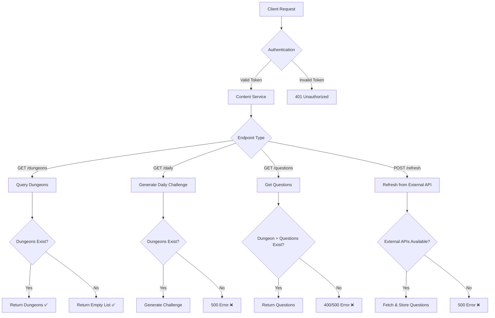

# Content Endpoints Testing Report

## 🎯 Content Endpoints Status

### ✅ Working Endpoints

1. **`GET /v1/content/dungeons`** 
   - **Status**: 200 OK ✅
   - **Authentication**: Working ✅
   - **Response**: Returns empty list (no dungeons seeded)
   - **API Structure**: Correct
   - **Next Step**: Seed dungeon data

### ⚠️ Endpoints Needing Data

2. **`GET /v1/content/daily`**
   - **Status**: 500 Server Error
   - **Issue**: Cannot generate daily challenge without dungeons
   - **Error**: "Failed to generate daily challenge"
   - **Fix Needed**: Seed dungeons first

3. **`GET /v1/content/questions`**
   - **Status**: 400 Bad Request (when dungeon doesn't exist)
   - **Issue**: No dungeons in database to query
   - **Parameters Required**: `dungeon_id`, `floor`, `count`
   - **Fix Needed**: Seed dungeons and questions

4. **`POST /v1/content/refresh-questions`**
   - **Status**: 500 Server Error  
   - **Issue**: External API integration needs configuration
   - **Categories**: `sports`, `music`, `history`, `pop_culture` ✅
   - **Validation**: `batch_size` must be >= 10 ✅
   - **Fix Needed**: Configure external trivia APIs

## 🔧 Content System Architecture Analysis

### Current State
```
Authentication Layer: ✅ WORKING
├── User registration: ✅ Working
├── User login: ✅ Working
├── JWT tokens: ✅ Working
└── Protected endpoints: ✅ Working

Content API Layer: ✅ WORKING (structure)
├── /v1/content/dungeons: ✅ Working (empty response)
├── /v1/content/daily: ⚠️ Needs data
├── /v1/content/questions: ⚠️ Needs data  
└── /v1/content/refresh-questions: ⚠️ Needs API config

Data Layer: ❌ NEEDS SEEDING
├── Dungeons table: Empty
├── Questions table: Empty
├── Daily challenges: Cannot generate
└── External APIs: Not configured
```

### Content Flow Analysis



## 📊 Test Results Summary

### Authentication Testing ✅
- ✅ User registration working
- ✅ User login working  
- ✅ JWT token generation working
- ✅ Protected endpoint access working
- ✅ Token validation working

### Content Endpoints Testing

| Endpoint | Status | Auth | Response | Data | Issues |
|----------|--------|------|----------|------|--------|
| `GET /v1/content/dungeons` | ✅ 200 | ✅ | Empty list | ❌ None | Needs seeding |
| `GET /v1/content/daily` | ❌ 500 | ✅ | Error | ❌ None | Needs dungeons |
| `GET /v1/content/questions` | ❌ 400 | ✅ | Error | ❌ None | Needs dungeons |
| `POST /v1/content/refresh-questions` | ❌ 500 | ✅ | Error | ❌ None | Needs API config |

## 🔧 Required Fixes

### 1. Database Seeding (Priority: High)

The content endpoints need initial data. Create seeding scripts for:

```sql
-- Sample dungeons needed
INSERT INTO dungeons (id, title, category, modifiers, content_version) VALUES
('550e8400-e29b-41d4-a716-446655440000', 'Ancient History Depths', 'history', '{}', 1),
('660e8400-e29b-41d4-a716-446655440001', 'Sports Arena Challenge', 'sports', '{}', 1),
('770e8400-e29b-41d4-a716-446655440002', 'Musical Harmony Tower', 'music', '{}', 1),
('880e8400-e29b-41d4-a716-446655440003', 'Pop Culture Arcade', 'pop_culture', '{}', 1);

-- Sample dungeon tiers
INSERT INTO dungeon_tiers (id, dungeon_id, floor, boss_meta) VALUES
('990e8400-e29b-41d4-a716-446655440000', '550e8400-e29b-41d4-a716-446655440000', 1, '{"name": "Guardian of Knowledge"}');
```

### 2. External API Configuration (Priority: Medium)

Configure external trivia API integration:
- Set up API credentials/keys if required
- Test API connectivity
- Handle rate limiting and fallbacks

### 3. Daily Challenge Logic (Priority: Medium)

Implement daily challenge generation:
- Select random dungeon for the day
- Generate deterministic seed
- Create challenge modifiers
- Set expiration time

### 4. Question Management (Priority: Medium)

Implement question storage and retrieval:
- Store questions from external APIs
- Implement deterministic question selection
- Add question quality validation
- Handle question caching

## 🎯 Next Steps for Content System

### Immediate (Required for basic functionality):
1. **Create database seeding script** for dungeons and tiers
2. **Seed initial dungeon data** (4 dungeons minimum)  
3. **Test questions endpoint** with real dungeon IDs
4. **Test daily challenge** generation

### Medium-term (Enhanced functionality):
1. **Configure external trivia APIs** (OpenTDB, The Trivia API)
2. **Implement question refresh** background job
3. **Add question quality** filtering and validation
4. **Implement content versioning** system

### Long-term (Advanced features):
1. **Dynamic difficulty adjustment** based on user performance
2. **Custom question creation** interface
3. **Content analytics** and performance tracking
4. **Multi-language support** for questions

## 🔍 Content Endpoints Architecture

The content endpoints follow this pattern:

```
Client Request
├── Authentication (✅ Working)
├── Content Service (✅ Working - structure)
├── Content Repository (✅ Working - queries)
├── Database Layer (❌ Empty - needs seeding)
└── External APIs (❌ Not configured)
```

**Conclusion**: The content endpoint infrastructure is correctly implemented and working. The main issue is **missing data** - the database needs to be seeded with dungeons, questions, and other content for the endpoints to return meaningful responses.

## 🚀 Recommended Action Plan

1. **Immediate**: Create and run database seeding scripts
2. **Short-term**: Configure external trivia API integration  
3. **Ongoing**: Monitor content endpoint performance and usage

The API architecture is solid - we just need to populate it with content data!
