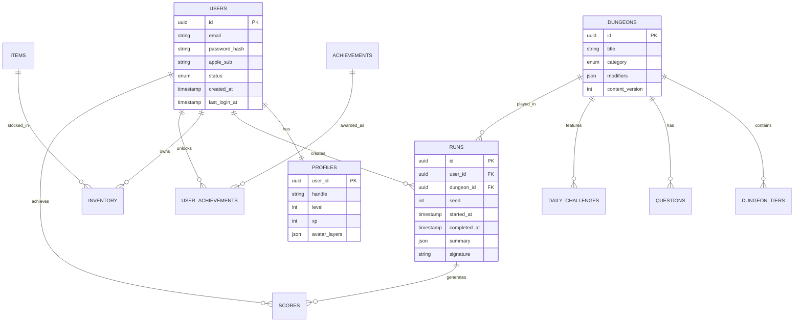

# LoreBound Backend - Project Structure

## 📂 Directory Structure

```
LoreBound/
├── 📄 README.md                    # Main project documentation
├── 📄 PROJECT_STRUCTURE.md         # This file - detailed structure
├── 📄 API_DOCUMENTATION.md         # API endpoint documentation
├── 📄 DEPLOYMENT_GUIDE.md          # Production deployment guide
├── 📄 ARCHITECTURE_OVERVIEW.md     # Existing architecture details
├── 📄 PROGRESS_UPDATE.md            # Development progress log
├── 📄 Context                      # Project context file
│
└── lorebound-backend/              # Main backend application
    ├── 📂 app/                     # Python application code
    │   ├── 📂 api/                 # API layer
    │   │   └── 📂 v1/              # API version 1
    │   │       └── 📂 routers/     # FastAPI route handlers
    │   │           ├── auth.py     # Authentication endpoints
    │   │           ├── content.py  # Content management endpoints
    │   │           ├── runs.py     # Game run endpoints
    │   │           ├── profile.py  # User profile endpoints
    │   │           ├── inventory.py # Inventory endpoints
    │   │           ├── leaderboards.py # Leaderboard endpoints
    │   │           └── config_flags.py # Feature flags
    │   │
    │   ├── 📂 core/                # Core utilities
    │   │   ├── config.py           # Application configuration
    │   │   ├── security.py         # JWT & password handling
    │   │   ├── dependencies.py     # FastAPI dependencies
    │   │   └── logging.py          # Logging configuration
    │   │
    │   ├── 📂 domain/              # Domain models & business logic
    │   │   ├── models.py           # SQLAlchemy database models
    │   │   └── enums.py            # Enumerations & constants
    │   │
    │   ├── 📂 services/            # Business logic layer
    │   │   ├── auth_service.py     # Authentication business logic
    │   │   ├── content_service.py  # Content management logic
    │   │   ├── run_service.py      # Game run logic
    │   │   ├── apple_service.py    # Apple Sign-In integration
    │   │   ├── trivia_api_client.py # External API client
    │   │   ├── exceptions.py       # Custom exceptions
    │   │   └── dependencies.py     # Service dependencies
    │   │
    │   ├── 📂 repositories/        # Data access layer
    │   │   ├── base.py             # Database session management
    │   │   ├── user_repo.py        # User data operations
    │   │   ├── content_repo.py     # Content data operations
    │   │   ├── run_repo.py         # Game run data operations
    │   │   ├── inventory_repo.py   # Inventory data operations
    │   │   └── leaderboard_repo.py # Leaderboard data operations
    │   │
    │   ├── 📂 schemas/             # Pydantic schemas for validation
    │   │   ├── auth.py             # Authentication request/response schemas
    │   │   ├── content.py          # Content schemas
    │   │   ├── run.py              # Game run schemas
    │   │   ├── user.py             # User profile schemas
    │   │   ├── inventory.py        # Inventory schemas
    │   │   ├── leaderboard.py      # Leaderboard schemas
    │   │   ├── config.py           # Configuration schemas
    │   │   └── email_validation.py # Email validation utilities
    │   │
    │   ├── 📂 jobs/                # Background job processing
    │   │   ├── worker.py           # Celery worker configuration
    │   │   └── 📂 tasks/           # Celery task definitions
    │   │       ├── analytics_tasks.py    # Analytics processing
    │   │       ├── daily_tasks.py        # Daily challenge generation
    │   │       └── leaderboard_tasks.py  # Leaderboard updates
    │   │
    │   ├── 📂 middleware/          # Custom middleware
    │   └── main.py                 # FastAPI application factory
    │
    ├── 📂 migrations/              # Database migrations (Alembic)
    │   ├── env.py                  # Alembic configuration
    │   ├── script.py.mako          # Migration template
    │   └── 📂 versions/            # Migration files
    │
    ├── 📂 tests/                   # Test suite
    │   ├── conftest.py             # Test configuration
    │   ├── test_auth.py            # Authentication tests
    │   ├── test_content.py         # Content tests
    │   ├── test_endpoints.py       # API endpoint tests
    │   ├── test_health.py          # Health check tests
    │   ├── test_integration.py     # Integration tests
    │   └── test_services.py        # Service layer tests
    │
    ├── 📂 scripts/                 # Utility scripts
    │   ├── generate_jwt_keys.py    # JWT key generation
    │   ├── test_registration.py    # Registration testing
    │   ├── test_live_api.py        # Live API testing
    │   ├── validate_config.py      # Configuration validation
    │   └── final_validation.py     # Production readiness check
    │
    ├── 📂 secrets/                 # Security credentials
    │   ├── jwt_private.pem         # JWT private key
    │   ├── jwt_public.pem          # JWT public key
    │   ├── apple_key.p8            # Apple Sign-In key
    │   └── apple_signin_key.p8     # Apple Sign-In certificate
    │
    ├── 🐳 docker-compose.yml       # Development environment
    ├── 🐳 Dockerfile               # Container configuration
    ├── ⚙️ pyproject.toml           # Python dependencies & config
    ├── ⚙️ alembic.ini              # Database migration config
    ├── ⚙️ Makefile                 # Build automation
    ├── 📄 README.md                # Backend-specific documentation
    ├── 📄 EMAIL_VALIDATION_FIX.md  # Email validation implementation
    └── 🧪 run_tests.py             # Test runner
```

## 🔧 Service Layer Detail

### Authentication Service (`auth_service.py`)
```python
class AuthenticationService:
    - register_user()         # User registration with email/password
    - login_user()           # User authentication
    - apple_sign_in()        # Apple Sign-In integration
    - refresh_token()        # JWT token refresh
    - get_current_user()     # Token validation
    - revoke_user_tokens()   # Logout/security
```

### Content Service (`content_service.py`)
```python
class ContentService:
    - get_dungeons()         # Fetch available dungeons
    - get_dungeon_details()  # Specific dungeon information
    - get_questions()        # Deterministic question selection
    - get_daily_challenge()  # Daily challenge generation
    - refresh_questions()    # External API integration
```

### Run Service (`run_service.py`)
```python
class RunService:
    - start_run()           # Initialize game session
    - submit_run()          # Process completed run
    - get_user_runs()       # User's game history
    - abandon_run()         # Cancel active run
    - validate_signature()  # Anti-cheat validation
```

## 🗄️ Database Schema Overview



## 🌐 API Layer Structure

### Router Organization
```
/v1/auth/          # Authentication endpoints
├── register       # POST - User registration
├── login          # POST - User login
├── apple          # POST - Apple Sign-In
├── refresh        # POST - Token refresh
├── me             # GET - Current user info
└── logout         # POST - User logout

/v1/content/       # Content management
├── dungeons       # GET - List dungeons
├── dungeons/{id}  # GET - Dungeon details
├── questions      # GET - Get questions
├── daily          # GET - Daily challenge
└── refresh-questions # POST - Admin refresh

/v1/runs/          # Game runs
├── start          # POST - Start new run
├── {id}/submit    # POST - Submit run
├── {id}           # GET - Run details
├── {id}/abandon   # POST - Abandon run
└── stats/me       # GET - User statistics

/v1/profile/       # User profiles
├── /              # GET/PUT - Profile management

/v1/inventory/     # User inventory
├── /              # GET - User items
└── equip          # POST - Equip items

/v1/leaderboards/  # Leaderboards
├── /              # GET - Global rankings
└── me             # GET - User rank
```

## 🔐 Security Architecture

### Authentication Flow
1. **Registration**: Email/password → bcrypt hash → JWT tokens
2. **Login**: Credentials validation → JWT tokens
3. **Apple Sign-In**: Apple token validation → JWT tokens
4. **Authorization**: JWT validation → User context

### Anti-Cheat System
1. **Run Initialization**: Generate cryptographic signature
2. **Client Validation**: Verify game state integrity
3. **Submission**: Validate signature + timing constraints
4. **Score Processing**: Server-side score calculation

## 🔄 Background Job Architecture

### Celery Task Organization
```
jobs/
├── worker.py              # Celery worker configuration
└── tasks/
    ├── analytics_tasks.py     # User analytics processing
    ├── daily_tasks.py         # Daily challenge generation
    └── leaderboard_tasks.py   # Leaderboard calculations
```

### Scheduled Tasks
- **Daily Challenges**: Generated at midnight UTC
- **Leaderboard Updates**: Hourly recalculation
- **Analytics Processing**: User engagement metrics
- **Content Refresh**: External API synchronization

## 📊 Configuration Management

### Environment-Based Configuration
- **Development**: Local database, debug logging
- **Staging**: Cloud database, info logging
- **Production**: Encrypted secrets, error logging

### Feature Flags
- **Apple Sign-In**: Enable/disable Apple authentication
- **Daily Challenges**: Toggle daily content
- **Anti-Cheat**: Strict/relaxed validation modes
- **External APIs**: Fallback content sources

This structure ensures scalability, maintainability, and clear separation of concerns across all layers of the application.
