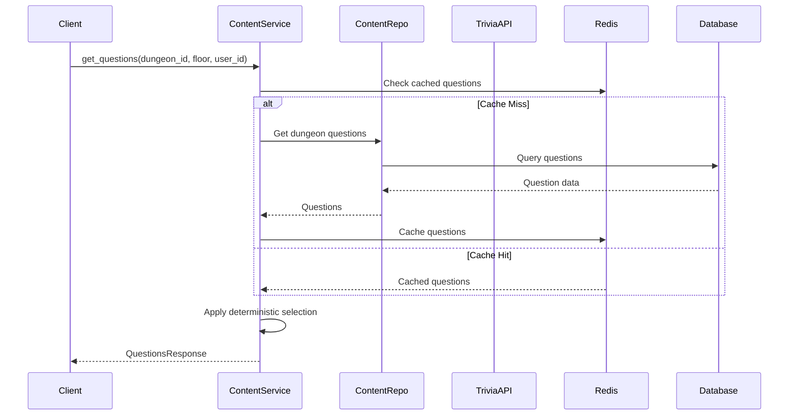
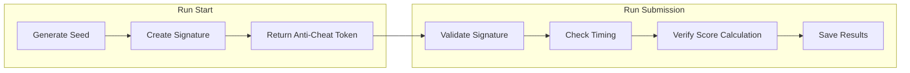
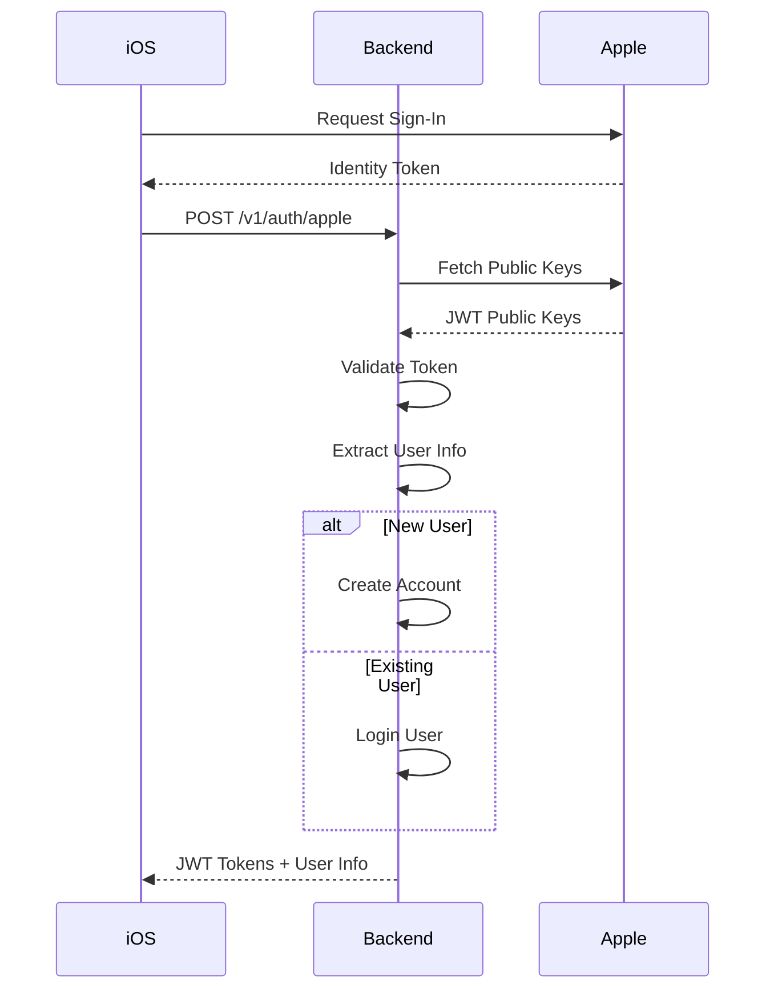
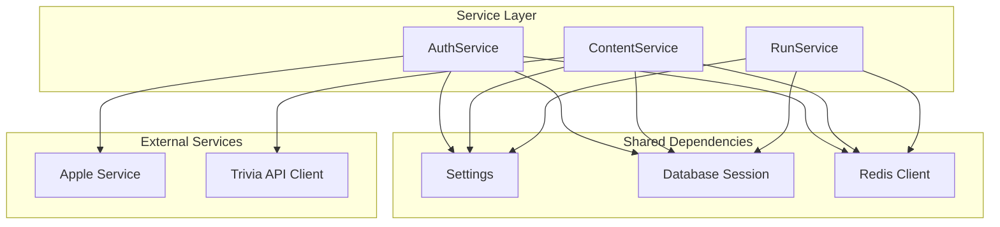

# LoreBound Backend - Services Overview

## 🏗️ Service Architecture

The LoreBound backend follows a layered service architecture with clear separation of concerns:

## 🔐 Authentication Service

**Location**: `app/services/auth_service.py`

### Purpose
Handles all user authentication operations including registration, login, JWT token management, and Apple Sign-In integration.

### Core Methods

```python
class AuthenticationService:
    async def register_user(registration_data, session) -> AuthResponse
    async def login_user(login_data, session) -> AuthResponse  
    async def apple_sign_in(apple_data, session) -> AuthResponse
    async def refresh_token(refresh_data, session) -> TokenResponse
    async def get_current_user(access_token, session) -> User
    async def revoke_user_tokens(user_id, session) -> None
```

### Key Features
- **Password Security**: bcrypt hashing with salt
- **JWT Tokens**: RSA256 signed access/refresh tokens
- **Apple Integration**: Identity token validation
- **Email Normalization**: Lowercase email handling
- **Profile Creation**: Automatic profile setup
- **Transaction Management**: Database commit/rollback

### Dependencies
- `UserRepository` - User data operations
- `AppleSignInService` - Apple authentication
- `Settings` - Configuration management

### Security Features
- Password length validation (8-128 characters)
- Email format validation with fallback
- Handle uniqueness enforcement
- Account status checking
- Token expiration management

---

## 🎯 Content Service

**Location**: `app/services/content_service.py`

### Purpose
Manages game content including dungeons, questions, daily challenges, and external trivia API integration.

### Core Methods

```python
class ContentService:
    async def get_dungeons(user_id, session) -> List[DungeonResponse]
    async def get_dungeon_details(dungeon_id, user_id, session) -> DungeonResponse
    async def get_questions(dungeon_id, floor, count, user_id, session) -> QuestionsResponse
    async def get_daily_challenge(user_id, session) -> DailyChallengeResponse
    async def refresh_question_pool(category, batch_size, session) -> RefreshResponse
```

### Key Features
- **Deterministic Questions**: Same user+dungeon+floor = same questions
- **Daily Challenges**: Auto-generated daily content
- **External API Integration**: Multiple trivia sources
- **Content Versioning**: Version-controlled content updates
- **Caching Strategy**: Redis-based question caching
- **Dynamic Difficulty**: Adaptive question selection

### Data Flow



### External API Integration
- **Trivia API**: Fetches questions by category
- **Question Validation**: Ensures quality and format
- **Rate Limiting**: Respects API limits
- **Fallback Strategy**: Local questions if API fails

---

## 🎮 Game Run Service

**Location**: `app/services/run_service.py`

### Purpose
Manages game sessions including run creation, anti-cheat validation, score calculation, and progression tracking.

### Core Methods

```python
class RunService:
    async def start_run(user_id, start_data, session) -> RunResponse
    async def submit_run(user_id, run_id, submit_data, session) -> RunResponse
    async def get_user_runs(user_id, limit, offset, session) -> List[RunResponse]
    async def get_run_details(run_id, user_id, session) -> RunResponse
    async def abandon_run(run_id, user_id, session) -> dict
    async def get_user_stats(user_id, session) -> RunStatsResponse
```

### Anti-Cheat System



### Key Features
- **Cryptographic Signatures**: Run integrity validation
- **Server-Side Scoring**: Prevents score manipulation
- **Timing Validation**: Ensures realistic completion times
- **Progress Tracking**: Real-time run state management
- **Statistics Calculation**: Performance metrics
- **Leaderboard Integration**: Automatic ranking updates

### Run States
1. **PENDING**: Run created, not started
2. **IN_PROGRESS**: Active gameplay
3. **COMPLETED**: Successfully finished
4. **ABANDONED**: Manually cancelled
5. **EXPIRED**: Timed out

---

## 👤 User Service

**Location**: Integrated across repositories and auth service

### Purpose
Manages user profiles, progression, inventory, and achievement systems.

### Core Features

#### Profile Management
```python
# User profile operations
async def get_profile(user_id) -> ProfileResponse
async def update_profile(user_id, profile_data) -> ProfileResponse
async def update_avatar(user_id, avatar_layers) -> ProfileResponse
```

#### Progression System
```python
# XP and leveling
async def add_xp(user_id, xp_amount) -> ProfileResponse
async def calculate_level(xp) -> int
async def get_level_progress(user_id) -> ProgressResponse
```

#### Inventory Management
```python
# Item operations
async def get_inventory(user_id) -> InventoryResponse
async def add_item(user_id, item_id) -> InventoryResponse
async def equip_item(user_id, item_id, slot) -> InventoryResponse
async def get_equipped_items(user_id) -> dict
```

### Progression Formula
```python
def calculate_level(xp: int) -> int:
    # Level = floor(sqrt(xp / 100)) + 1
    # Levels at: 0, 100, 400, 900, 1600, 2500 XP...
    return max(1, int(math.sqrt(xp / 100)) + 1)
```

---

## 🍎 Apple Sign-In Service

**Location**: `app/services/apple_service.py`

### Purpose
Handles Apple Sign-In integration for iOS users, including token validation and user information extraction.

### Core Methods

```python
class AppleSignInService:
    async def verify_identity_token(identity_token) -> AppleUserInfo
    async def get_apple_public_keys() -> dict
    async def validate_jwt_signature(token, public_key) -> dict
```

### Apple Sign-In Flow



### Key Features
- **Token Validation**: JWT signature verification
- **Public Key Caching**: Apple's rotating keys
- **User Mapping**: Apple ID to internal user
- **Automatic Registration**: Seamless account creation
- **Handle Generation**: Unique handle assignment

---

## 🔄 Background Job Services

**Location**: `app/jobs/`

### Celery Worker Configuration

```python
# worker.py
from celery import Celery

celery_app = Celery(
    "lorebound",
    broker=settings.celery_broker_url,
    backend=settings.celery_result_backend,
    include=[
        "app.jobs.tasks.daily_tasks",
        "app.jobs.tasks.leaderboard_tasks", 
        "app.jobs.tasks.analytics_tasks"
    ]
)
```

### Daily Tasks

```python
# tasks/daily_tasks.py
@celery_app.task
def generate_daily_challenge():
    """Generate daily challenge at midnight UTC."""
    
@celery_app.task  
def refresh_question_pool():
    """Refresh questions from external APIs."""
    
@celery_app.task
def cleanup_expired_runs():
    """Clean up expired game runs."""
```

### Leaderboard Tasks

```python
# tasks/leaderboard_tasks.py
@celery_app.task
def update_global_leaderboards():
    """Recalculate global rankings."""
    
@celery_app.task
def generate_weekly_rankings():
    """Generate weekly leaderboard snapshots."""
    
@celery_app.task
def calculate_user_rankings():
    """Update individual user rankings."""
```

### Analytics Tasks

```python
# tasks/analytics_tasks.py
@celery_app.task
def process_user_engagement():
    """Calculate user engagement metrics."""
    
@celery_app.task
def generate_content_analytics():
    """Analyze question performance."""
    
@celery_app.task
def update_game_statistics():
    """Update global game statistics."""
```

---

## 🔧 Service Dependencies

### Dependency Injection

```python
# services/dependencies.py
async def get_auth_service_with_session(
    session: AsyncSession = Depends(get_session),
    apple_service: AppleSignInService = Depends(get_apple_service),
    settings: Settings = Depends(get_settings)
) -> tuple[AuthenticationService, AsyncSession]:
    user_repo = UserRepository(session)
    auth_service = AuthenticationService(user_repo, apple_service, settings)
    return auth_service, session
```

### Service Composition



---

## 🛡️ Security Features Across Services

### Authentication Security
- **Password Hashing**: bcrypt with salt
- **JWT Tokens**: RSA256 signatures
- **Token Refresh**: Secure refresh mechanism
- **Account Lockout**: Failed attempt protection

### API Security  
- **Rate Limiting**: Per-endpoint limits
- **CORS Configuration**: Origin restrictions
- **Input Validation**: Pydantic schemas
- **SQL Injection Protection**: Parameterized queries

### Anti-Cheat Security
- **Cryptographic Signatures**: Run validation
- **Server-Side Scoring**: Score calculation
- **Timing Analysis**: Realistic completion times
- **Pattern Detection**: Suspicious behavior identification

---

## 📊 Performance Optimizations

### Caching Strategy
- **Redis Caching**: Frequently accessed data
- **Question Caching**: Deterministic selection optimization
- **User Session Caching**: Authentication state
- **Leaderboard Caching**: Pre-calculated rankings

### Database Optimization
- **Connection Pooling**: Efficient connection management
- **Query Optimization**: Indexed queries
- **Async Operations**: Non-blocking database calls
- **Transaction Management**: Proper commit/rollback

### Background Processing
- **Celery Tasks**: Async job processing
- **Queue Management**: Priority-based task scheduling
- **Error Handling**: Retry mechanisms
- **Resource Management**: Memory and CPU optimization

This service architecture ensures scalability, maintainability, and robust game functionality while maintaining security and performance standards.
